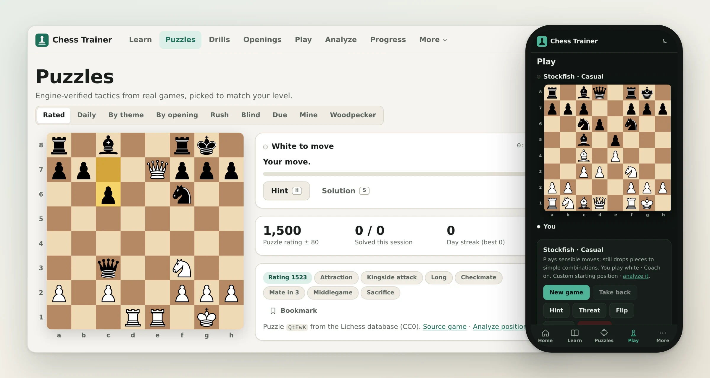
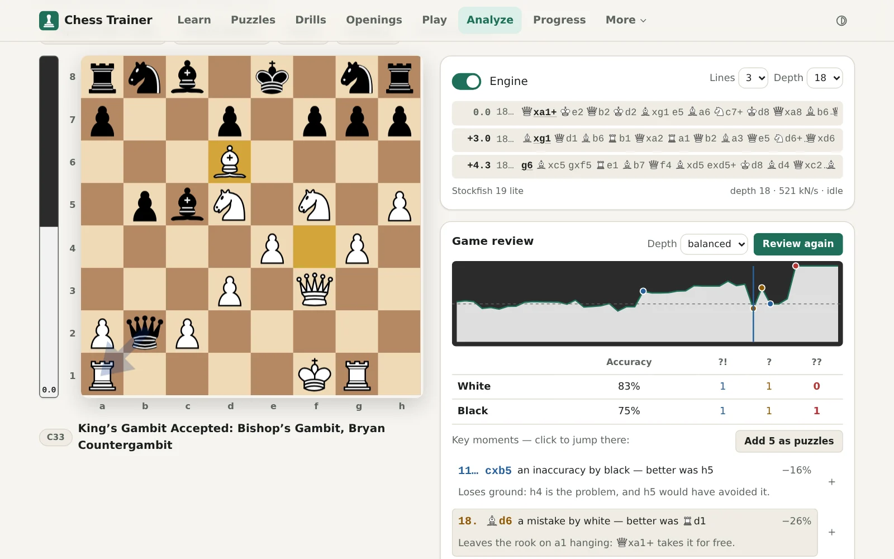
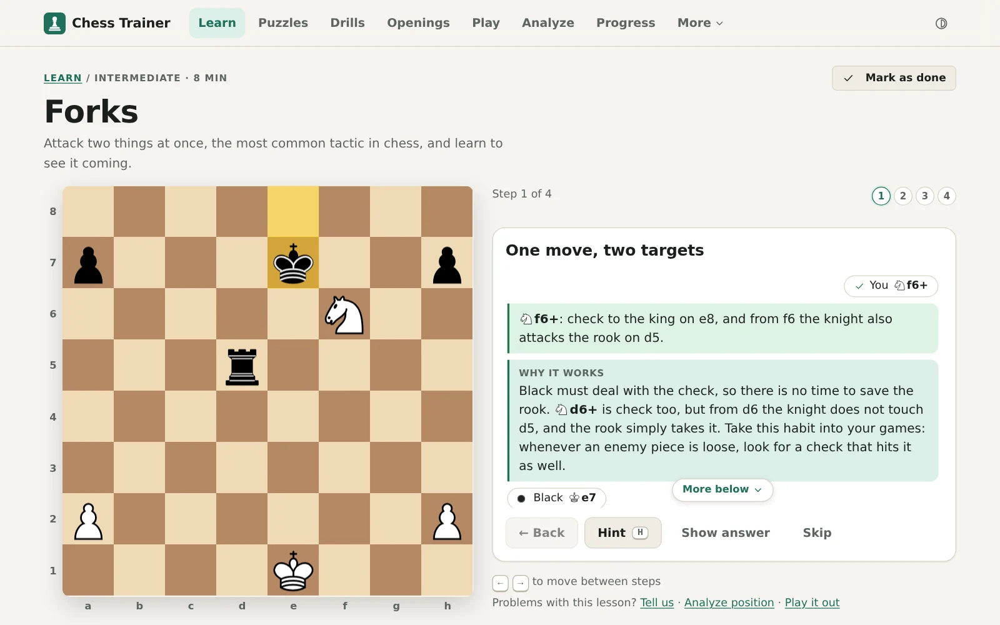
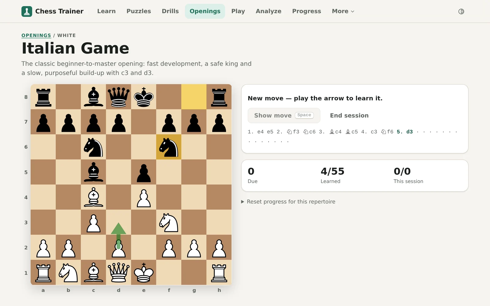
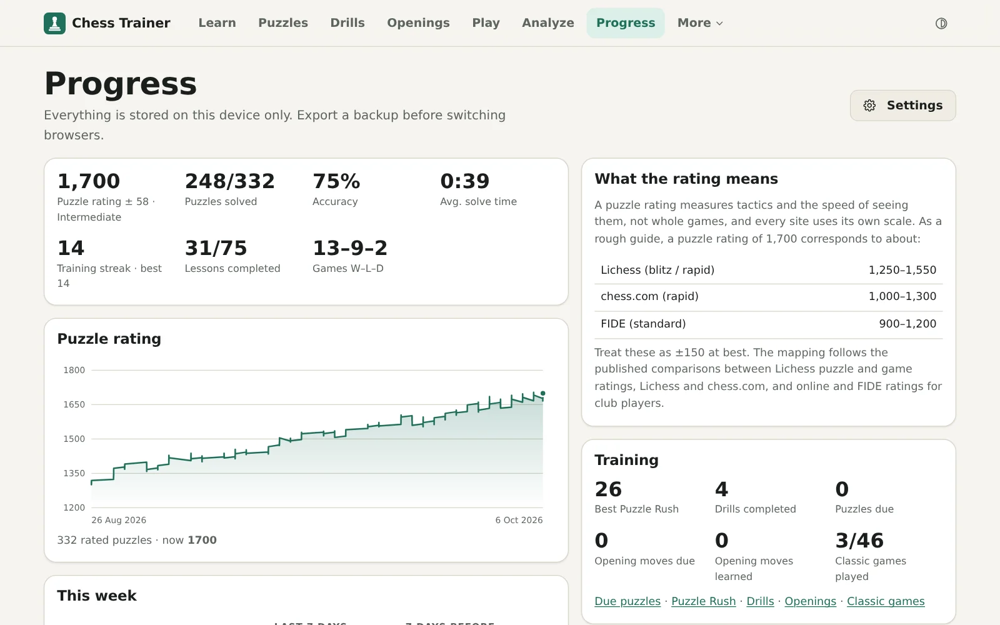
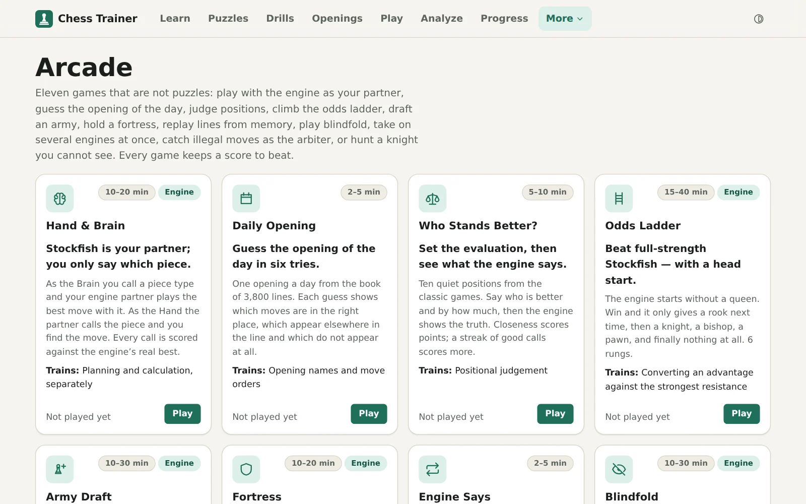
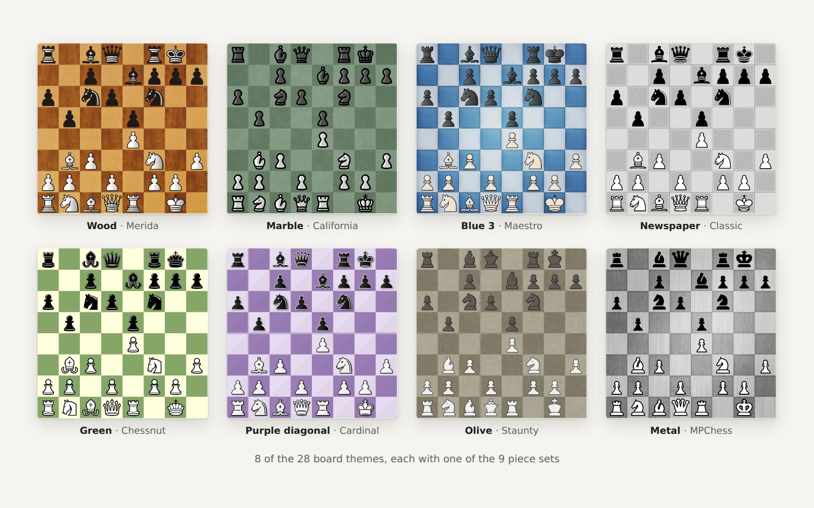

<p align="center">
  <a href="https://real-fruit-snacks.github.io/chess-trainer/">
    
  </a>
</p>

<h1 align="center">Chess Trainer</h1>

<p align="center">
  <strong>Learn, practise and play chess at any level — free, private, and fully offline.</strong>
</p>

<p align="center">
  <a href="https://github.com/Real-Fruit-Snacks/chess-trainer/actions/workflows/ci.yml"></a>
  <a href="https://github.com/Real-Fruit-Snacks/chess-trainer/actions/workflows/deploy.yml"></a>
  <a href="https://github.com/Real-Fruit-Snacks/chess-trainer/releases"></a>
  <a href="LICENSE"></a>
  
</p>

<p align="center">
  <a href="https://real-fruit-snacks.github.io/chess-trainer/"><strong>Open the app</strong></a>
  &nbsp;·&nbsp;
  <a href="docs/FEATURES.md">Features</a>
  &nbsp;·&nbsp;
  <a href="docs/ARCHITECTURE.md">Architecture</a>
  &nbsp;·&nbsp;
  <a href="CONTRIBUTING.md">Contributing</a>
  &nbsp;·&nbsp;
  <a href="CHANGELOG.md">Changelog</a>
</p>

<p align="center">
  
</p>

A complete chess trainer in a single web app: lessons, 48,000 puzzles, drills, opening repertoires,
a Stockfish opponent with a coach, a human-like opponent that plays like a person of any rating from
600 to 2600, game analysis and an arcade of chess games — with nothing to sign up for. It runs
entirely in your browser, installs as an app and keeps working on a plane.

## Why Chess Trainer

- **Everything in one place.** Learn a concept, drill it, solve puzzles on it, play it against the
  engine and review the game — every part links to the others.
- **Yours, and only yours.** No sign-up, no ads, no tracking. Progress lives on your device. Sync
  between devices is end-to-end encrypted with a recovery phrase only you hold, so the sync service
  never sees your data; a backup is a file you keep; and you can connect your Lichess account.
  Optional network features are off by default.
- **Works everywhere.** Phones, tablets and desktops, light, dark or black, online and offline, with
  screen readers and the keyboard.
- **Honest chess.** Every lesson task, endgame drill position, study move and repertoire move is
  checked with Stockfish in CI, the puzzle rating is Glicko-2, and the coach explains mistakes with
  rules, not guesswork.

## Highlights

**Learn** — 75 interactive lessons in three courses, each a conversation with a coach who says why
every move works, answers your mistakes with the reply that punishes them, and plays combinations
out move by move; a placement quiz that picks your starting point, spaced recall of what you
learned, lessons you already know marked done in a tap, and a gallery of the nineteen named mates.

**Puzzles** — 48,000 engine-verified tactics across eight rating bands, a Glicko-2 rating with
calibration, daily puzzle, Puzzle Rush, blind puzzles (the line in notation only, the board frozen
at the start), Woodpecker sets, a review queue for misses, and puzzles made from the blunders in
your own games.

**Play** — Stockfish 19 at eight levels from a beatable Newcomer to full strength, or a human-like
opponent: Maia-3, a neural network trained on millions of real games, which plays like a person rated
600 to 2600 — the plausible plans and the missed tactics of that rating, not an engine's random
blunders (an optional 25 MB download, run on your device). With clocks, take-backs, hints, a coach
that pauses on a mistake and explains it, a blunder check that asks "checks, captures, threats?"
before a move that hangs material, blindfold play, two players at one device, and a start from any
position.

**Play online** — a waiting room for live games against people, with no account: post a game at a
tap and carry on with anything else in the app until someone joins, join one from the list, or send
a friend a private link. The relay referees, keeping both clocks; you play under a made-up name, and
messages are a few set phrases, so nothing a stranger types ever reaches you. Signed in to Lichess,
the same post looks for an opponent there too, rated if you like, and the game is played here.

**Analyze** — multi-line analysis by a multi-threaded Stockfish (with its full network as an optional
99 MB download), a full variation tree, a position report, game review with an evaluation graph and
key moments explained in words — or analyse the game yourself first and let the review score what
you found — Lichess and chess.com imports, and shareable links that carry the whole game.

**Sync** — turn on sync between devices and your phone, tablet and computer stay in step: progress,
lessons, review schedules, repertoires, analyses, games and settings, so any device is ready to
play as you left it — and each device can keep any of them to itself. There is no account, only a
12-word recovery phrase (or its QR code), and everything is encrypted on the device before it
leaves. Changes made offline are merged, not overwritten. Or connect your Lichess account and the app keeps
in step with it, both ways: puzzles you solve here count on Lichess, your Lichess puzzle history and
its misses come here, games you play are imported to Lichess, and your own repertoires and saved
analyses live in private Lichess studies.

**Train** — coordinate, vision and endgame drills on a 41-rung ladder, "What's the threat?" (name
the opponent's threat, then meet it — in real positions and in your own games), sixteen opening
repertoires trained with spaced repetition (or import your own), eight endgame studies and 46 classic
games to guess move by move.

**Arcade** — eleven games that are not puzzles: a simul against up to eight engines at once, each
board with its own clocks, Hand & Brain with Stockfish as your partner, a daily opening Wordle, Who
Stands Better?, the Odds Ladder, Army Draft, Fortress, Engine Says, Blindfold, Arbiter (catch the
illegal move in a replayed classic) and Ghost Knight (hunt a knight you only see every third move).

<table>
  <tr>
    <td width="33%"></td>
    <td width="33%"></td>
    <td width="33%"></td>
  </tr>
  <tr>
    <td align="center">Game review</td>
    <td align="center">Lessons with a coach</td>
    <td align="center">Opening repertoires</td>
  </tr>
  <tr>
    <td width="33%"></td>
    <td width="33%"></td>
    <td width="33%"></td>
  </tr>
  <tr>
    <td align="center">Progress</td>
    <td align="center">The arcade</td>
    <td align="center">Board themes and piece sets</td>
  </tr>
</table>

The full list, section by section, is in [docs/FEATURES.md](docs/FEATURES.md).

## Getting started

### Use it

Open **<https://real-fruit-snacks.github.io/chess-trainer/>**. To install it as an app, use the
install button in the address bar (Chrome and Edge), _Share → Add to Home Screen_ (iPhone and iPad)
or _Menu → Install app_ (Android). Everything the app needs downloads on the first visit, after
which it works offline; _Download every puzzle_ in Settings keeps all 48,000 puzzles offline too.

### Run it locally

```bash
git clone https://github.com/Real-Fruit-Snacks/chess-trainer.git
cd chess-trainer
npm install     # Node 22.22 or newer
npm run dev     # downloads the engine and the human-like opponent on first run, then serves http://localhost:5173
```

`npm run check` runs CI's quality and build gates locally: lint, dead-code and dependency check,
format check, typecheck, unit tests, a production build and the bundle budget. CI also holds the
unit tests to a coverage floor, validates the puzzle data, and runs the end-to-end suite in four
browser projects (desktop and phone Chromium, Firefox, WebKit), a smoke test under the production
base path, the visual snapshots and Lighthouse, and a separate workflow checks the chess content
with Stockfish — see [what CI runs](CONTRIBUTING.md#what-ci-runs). The other scripts are listed in
[CONTRIBUTING.md](CONTRIBUTING.md#scripts).

### Host your own

Fork the repository, enable its workflows on the **Actions** tab, set **Settings → Pages → Source**
to **GitHub Actions**, and push to `main`. Once CI has passed, the deploy workflow builds the site
with the right base path and deploys it; a version tag publishes a GitHub release. Custom domains
and other static hosts are covered in [docs/DEPLOYMENT.md](docs/DEPLOYMENT.md).

Sync between devices and live games go through a tiny relay of your own: a Cloudflare Worker with
D1 and Durable Objects on the free plan, or a plain Node server. [relay/README.md](relay/README.md)
shows how to deploy it and what it can and cannot see. Setting `syncRelay` to `''` in
`src/site.config.ts` leaves both out.

## Built with

| Part            | Technology                                                                                                         |
| --------------- | ------------------------------------------------------------------------------------------------------------------ |
| App             | [React 19](https://react.dev), [TypeScript](https://www.typescriptlang.org), [Vite](https://vite.dev), Workbox     |
| Engine          | [Stockfish 19](https://stockfishchess.org) as WebAssembly in a worker: multi-threaded, full network optional       |
| Human-like play | [Maia-3](https://huggingface.co/UofTCSSLab/Maia3-5M) run by [ONNX Runtime Web](https://onnxruntime.ai) in a worker |
| Board and chess | [Chessground](https://github.com/lichess-org/chessground), [chess.js](https://github.com/jhlywa/chess.js)          |
| Data            | [Lichess](https://lichess.org) puzzle database and the chess-openings dataset (both CC0)                           |
| Sync and live   | Web Crypto (HKDF, AES-GCM) on the device; a relay on Cloudflare Workers, D1 and Durable Objects, or Node           |

Any evergreen browser with WebAssembly and Web Workers works: Chrome and Edge 111+, Firefox 121+,
Safari 16.4+ (iOS 16.4+); the test suite runs on Chromium, Firefox and WebKit. The interface is in
British English.

## Contributing

Bug reports, lesson proposals and pull requests are welcome — the most valuable contributions are
chess content, and the [content guide](docs/CONTENT_GUIDE.md) shows how a lesson, drill or repertoire
is written and verified. Please read [CONTRIBUTING.md](CONTRIBUTING.md) first.

## Licence

Chess Trainer is licensed under the [GNU General Public License v3.0 or later](LICENSE). It bundles
GPL-licensed components that are inseparable from the delivered app (Chessground for the board,
Stockfish for the engine), so a copyleft licence for the whole is the honest choice. The human-like
opponent's model, Maia-3, and Lichess's board pictures are under the GNU Affero General Public
License v3, which the GPL v3 allows the app to be combined with
([LICENSES/AGPL-3.0.txt](LICENSES/AGPL-3.0.txt)). Third-party components
and their licences are listed in [THIRD_PARTY_NOTICES.md](THIRD_PARTY_NOTICES.md). The built site
ships the texts (`licence.txt`, `licence-agpl.txt`, `licence-apache.txt` and `notices.txt`) and links
them from the footer of every page, next to the credits the components ask for — among them the
chosen piece set's. The piece sets come from the Lichess collection under their own licences; four of
them (California, Maestro, Staunty and Cardinal) are CC BY-NC-SA 4.0 and may not be used commercially,
so a commercial fork must remove them (see THIRD_PARTY_NOTICES.md).
