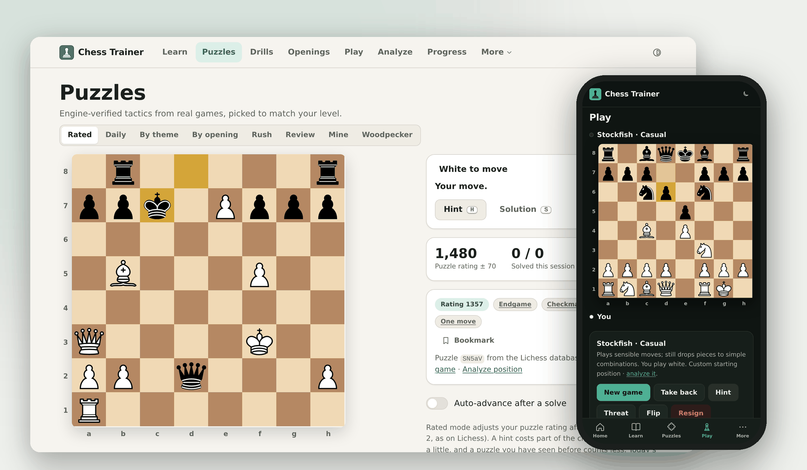
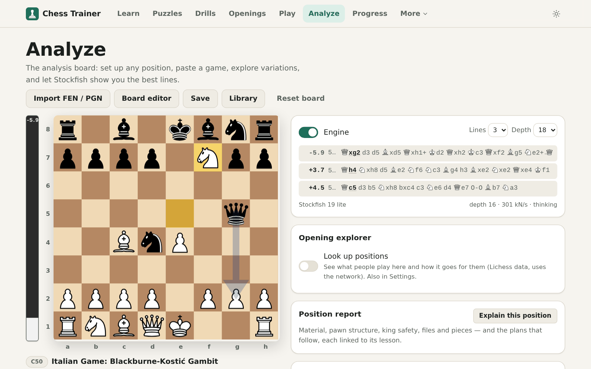
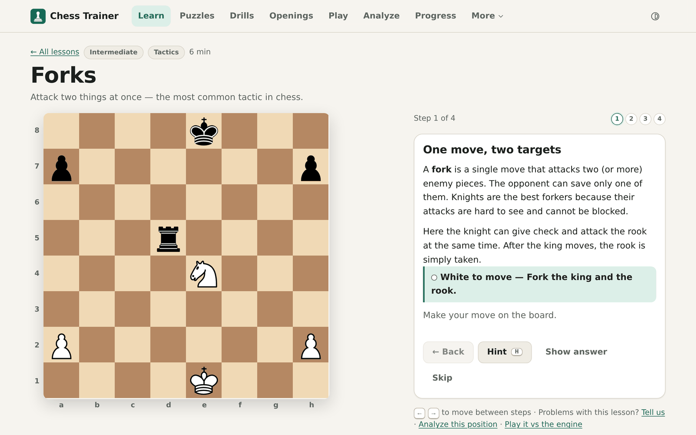
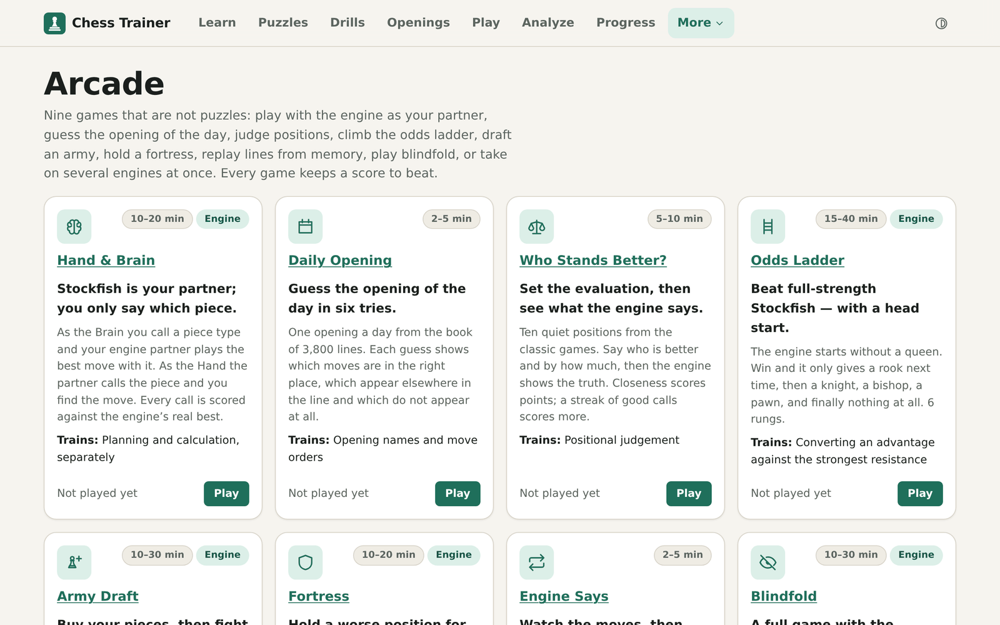

<p align="center">
  <a href="https://real-fruit-snacks.github.io/chess-trainer/">
    
  </a>
</p>

<h1 align="center">Chess Trainer</h1>

<p align="center">
  <strong>Learn, practise and play chess at any level — free, private, and fully offline.</strong>
</p>

<p align="center">
  <a href="https://github.com/Real-Fruit-Snacks/chess-trainer/actions/workflows/ci.yml"></a>
  <a href="https://github.com/Real-Fruit-Snacks/chess-trainer/actions/workflows/deploy.yml"></a>
  <a href="https://github.com/Real-Fruit-Snacks/chess-trainer/releases"></a>
  <a href="LICENSE"></a>
  
</p>

<p align="center">
  <a href="https://real-fruit-snacks.github.io/chess-trainer/"><strong>Open the app</strong></a>
  &nbsp;·&nbsp;
  <a href="docs/FEATURES.md">Features</a>
  &nbsp;·&nbsp;
  <a href="docs/ARCHITECTURE.md">Architecture</a>
  &nbsp;·&nbsp;
  <a href="CONTRIBUTING.md">Contributing</a>
  &nbsp;·&nbsp;
  <a href="CHANGELOG.md">Changelog</a>
</p>

<p align="center">
  
</p>

A complete chess trainer in a single web app: lessons, 48,000 puzzles, drills, opening repertoires,
a Stockfish opponent with a coach, game analysis and an arcade of chess games — with nothing to sign
up for. It runs entirely in your browser, installs as an app and keeps working on a plane.

## Why Chess Trainer

- **Everything in one place.** Learn a concept, drill it, solve puzzles on it, play it against the
  engine and review the game — every part links to the others.
- **Yours, and only yours.** No account, no server, no ads, no tracking. Progress lives on your
  device, and a backup is a file you keep. Optional network features are off by default.
- **Works everywhere.** Phones, tablets and desktops, light, dark or black, online and offline, with
  screen readers and the keyboard.
- **Honest chess.** Every lesson position, drill, study and repertoire line is engine-verified, the
  puzzle rating is Glicko-2, and the coach explains mistakes with rules, not guesswork.

## Highlights

**Learn** — 75 interactive lessons in three courses, a placement quiz that picks your starting
point, spaced recall of what you learned, and a gallery of the nineteen named mates.

**Puzzles** — 48,000 engine-verified tactics across eight rating bands, a Glicko-2 rating with
calibration, daily puzzle, Puzzle Rush, Woodpecker sets, a review queue for misses, and puzzles made
from the blunders in your own games.

**Play** — Stockfish 19 at eight levels from a beatable Newcomer to full strength, with clocks,
take-backs, hints, a coach that pauses on a mistake and explains it, blindfold play, two players at
one device, and a start from any position.

**Analyze** — multi-line engine analysis, a full variation tree, a position report, game review with
an evaluation graph and key moments explained in words, Lichess and chess.com imports, and shareable
links that carry the whole game.

**Train** — coordinate, vision and endgame drills on a 41-rung ladder, sixteen opening repertoires
trained with spaced repetition (or import your own), eight endgame studies and 46 classic games to
guess move by move.

**Arcade** — nine games that are not puzzles: a simul against up to eight engines at once, each
board with its own clocks, Hand & Brain with Stockfish as your partner, a daily opening Wordle, Who
Stands Better?, the Odds Ladder, Army Draft, Fortress, Engine Says and Blindfold.

<table>
  <tr>
    <td width="33%"></td>
    <td width="33%"></td>
    <td width="33%"></td>
  </tr>
  <tr>
    <td align="center">Analysis board and game review</td>
    <td align="center">Interactive lessons</td>
    <td align="center">The arcade</td>
  </tr>
</table>

The full list, section by section, is in [docs/FEATURES.md](docs/FEATURES.md).

## Getting started

### Use it

Open **<https://real-fruit-snacks.github.io/chess-trainer/>**. To install it as an app, use the
install button in the address bar (Chrome and Edge), _Share → Add to Home Screen_ (iPhone and iPad)
or _Menu → Install app_ (Android). Everything the app needs downloads on the first visit, after which
it works offline.

### Run it locally

```bash
git clone https://github.com/Real-Fruit-Snacks/chess-trainer.git
cd chess-trainer
npm install     # Node 22 or newer
npm run dev     # downloads the engine on first run, then serves http://localhost:5173
```

`npm run check` runs what CI runs: lint, dead-code and dependency check, format check, typecheck, unit
tests, a production build and the bundle budget.
The other scripts are listed in [CONTRIBUTING.md](CONTRIBUTING.md#scripts).

### Host your own

Fork the repository, set **Settings → Pages → Source** to **GitHub Actions**, and push to `main`.
The workflow builds the site with the right base path and deploys it; a version tag publishes a
GitHub release. Custom domains and other static hosts are covered in
[docs/DEPLOYMENT.md](docs/DEPLOYMENT.md).

## Built with

| Part            | Technology                                                                                                     |
| --------------- | -------------------------------------------------------------------------------------------------------------- |
| App             | [React 19](https://react.dev), [TypeScript](https://www.typescriptlang.org), [Vite](https://vite.dev), Workbox |
| Engine          | [Stockfish 19](https://stockfishchess.org) as WebAssembly, in a worker                                         |
| Board and chess | [Chessground](https://github.com/lichess-org/chessground), [chess.js](https://github.com/jhlywa/chess.js)      |
| Data            | [Lichess](https://lichess.org) puzzle database and the chess-openings dataset (both CC0)                       |

Any evergreen browser with WebAssembly and Web Workers works: Chrome and Edge 90+, Firefox 90+,
Safari 16+ (iOS 16+); the test suite runs on Chromium, Firefox and WebKit. The interface is in
English.

## Contributing

Bug reports, lesson proposals and pull requests are welcome — the most valuable contributions are
chess content, and the [content guide](docs/CONTENT_GUIDE.md) shows how a lesson, drill or repertoire
is written and verified. Please read [CONTRIBUTING.md](CONTRIBUTING.md) first.

## License

Chess Trainer is licensed under the [GNU General Public License v3.0 or later](LICENSE). It bundles
GPL-licensed components that are inseparable from the delivered app (Chessground for the board,
Stockfish for the engine), so a copyleft licence for the whole is the honest choice. Third-party
components and their licences are listed in [THIRD_PARTY_NOTICES.md](THIRD_PARTY_NOTICES.md).
